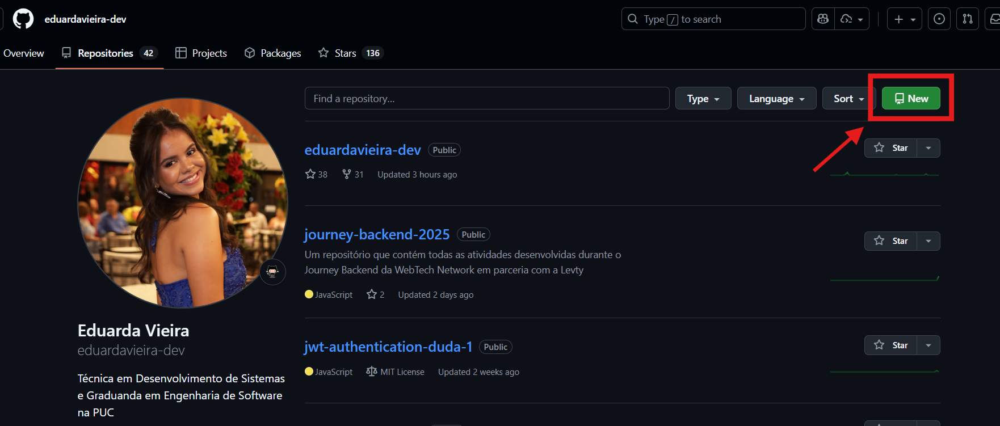
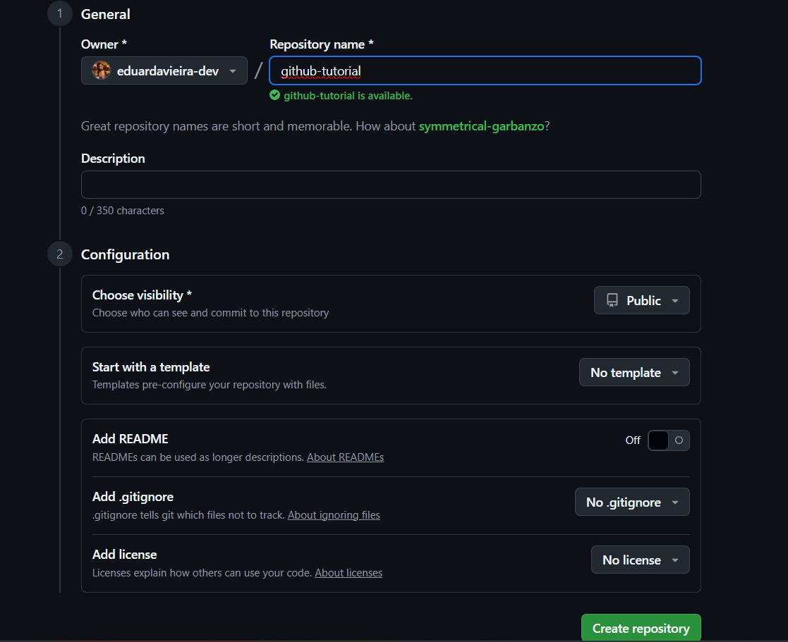
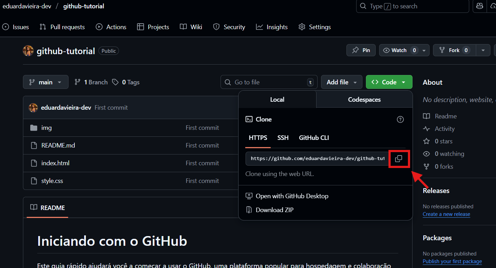

# O que é o GitHub?

O GitHub é uma plataforma baseada na nuvem que utiliza o Git para controle de versão. Ele permite que desenvolvedores e equipes armazenem, compartilhem e colaborem em projetos de forma remota. Por ser acessível pela internet, você pode trabalhar em seus repositórios de qualquer lugar, desde que tenha conexão com a web.

## Principais Funcionalidades

- **Hospedagem de Código**: Armazene seus projetos em repositórios privados ou públicos.
- **Colaboração Remota**: Trabalhe com outros desenvolvedores em tempo real, independentemente da localização.
- **Acessibilidade**: Acesse seus projetos de qualquer dispositivo conectado à internet.
- **Ferramentas Integradas**: Utilize recursos como revisão de código, integração contínua e gestão de tarefas.

O GitHub é uma ferramenta essencial para desenvolvedores que buscam flexibilidade e eficiência no desenvolvimento de software.

## Para começar a usar o GitHub, você precisará de:

1. **Uma conta no GitHub**: Acesse [github.com](https://github.com) e crie uma conta gratuita.
2. **Git instalado**: Instale o Git em sua máquina. Você pode baixar o instalador em [git-scm.com](https://git-scm.com/).
3. **Conhecimento básico de Git**: Familiarize-se com os comandos básicos do Git, como `git init`, `git add`, `git commit`, `git push`, `git pull` entre outros.
4. **Um projeto para versionar**: Tenha um projeto em mente que você gostaria de versionar e compartilhar.


## Criando e Enviando um Novo Projeto para o GitHub

1. **Crie um novo repositório no GitHub**:

   - Acesse [github.com](https://github.com)
   - Clique em "New" ou "+" no canto superior direito
     
   - Dê um nome ao seu repositório
   - Escolha se será público ou privado
    - **Não** selecione para inicializar com README, .gitignore ou licença (isso evita conflitos ao conectar o repositório local)  
     

2. **Crie um repositório local**: No seu computador, crie uma pasta para o projeto e inicialize um repositório Git:

   ```
   git init
   ```

3. **Adicione arquivos ao projeto**:

   - Crie ou copie os arquivos do seu projeto para a pasta
   - Adicione os arquivos ao controle de versão:

   ```
   git add .
   git status  # Verifique os arquivos adicionados
   ```

4. **Faça o primeiro commit**:

   ```
   git commit -m "Primeiro commit: Inicialização do projeto"
   ```

5. **Conecte ao GitHub**:
   ```
   git remote add origin https://github.com/seu-usuario/seu-repositorio.git
   ```
6. **Envie suas alterações**:
   ```
   git branch -M main # Renomeia a branch principal para main
   git push -u origin main
   ```

## Clonando e Contribuindo com Projetos Existentes

1. **Clone o repositório**:

   - Encontre o repositório no GitHub
   - Clique no botão "<>Code" e copie a URL
     
   - Clone localmente:

   ```bash
   git clone https://github.com/usuario/repositorio.git
   ```

2. **Faça suas alterações**:

   - Modifique os arquivos necessários
   - Adicione e commit as mudanças:

   ```bash
   git add .
   git commit -m "Descrição das alterações realizadas"
   ```

3. **Envie suas alterações**:

   ```bash
   git push
   ```


## Recursos Adicionais

- [GitFluence](https://www.gitfluence.com/)
- [Principais comandos Git](https://comandosgit.github.io/)
-  Extensão para Git e GitHub:  `GitLens — Git supercharged`